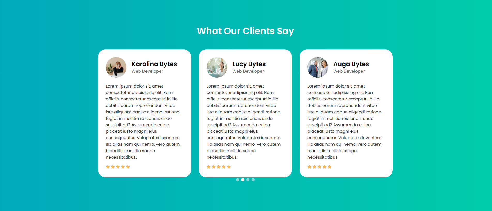

# Testimonials Template 1

A clean, modern, and responsive testimonials slider template built with HTML, CSS, and JavaScript (Swiper.js). This template is designed to showcase client testimonials in a sleek, sliding carousel that transitions from right to left.

## Features

- **Responsive Design**: Fully responsive layout that adjusts seamlessly across devices (mobile, tablet, desktop).
- **Swiper.js Integration**: Smooth sliding animations with configurable autoplay and pagination.
- **Customizable**: Easily modify the styles and content to suit your needs.
- **Centered Pagination**: Pagination bullets are perfectly centered below the testimonials.
- **Autoplay**: Testimonials automatically transition every 10 seconds.

## Technologies Used

- **HTML5**: Markup structure of the template.
- **CSS3**: Styling using modern CSS techniques including Flexbox and CSS Grid.
- **JavaScript**: For initializing and configuring the Swiper.js slider.
- **Swiper.js**: A powerful and flexible slider library for touch-friendly carousels.

## Installation

1. **Clone the repository:**
   git clone https://github.com/MrBytes10/Testimonials-Template1.git

2. **Navigate to the project directory:**
   cd Testimonials-Template

3. **Open `index.html` in your preferred web browser:**
   open index.html
   or
   double-click index.html

## Usage

- To change the testimonials content, simply update the HTML structure inside the `index.html` file.
- Modify the CSS in the `style.css` file to match your brand's colors and style.
- Adjust the Swiper.js settings in the `<script>` section of `index.html` to customize the slider behavior (e.g., autoplay duration, slide transition speed).

## Customization

### CSS Customization

- **Background Gradient**: Update the `body` background in `style.css` to change the overall look and feel.
- **Text Styling**: Modify font sizes, colors, and weights in the `.testimonials-item` classes to suit your design preferences.
- **Pagination Bullets**: Adjust the size, color, and position of the pagination bullets via the `.swiper-pagination-bullet` class.

### JavaScript Customization

- **Autoplay Timing**: Change the `autoplay` delay in the Swiper initialization script to set how long each testimonial stays on screen.
- **Responsive Settings**: Modify the `breakpoints` in the Swiper configuration to adjust how many slides are shown at different screen widths.

## Screenshot

## Contributing

If you have suggestions or improvements, feel free to submit a pull request or open an issue.

1. Fork the repository.
2. Create your feature branch: `git checkout -b feature/my-feature`.
3. Commit your changes: `git commit -m 'Add some feature'`.
4. Push to the branch: `git push origin feature/my-feature`.
5. Open a pull request.

## Credits

- [Swiper.js](https://swiperjs.com/) - The awesome library that powers the sliding testimonials.

## Contact

For any questions or support, please contact me: <a href="https://wa.me/+254742125032">Augastine</a>, or mail me at: mulu.bytes@gmail.com
